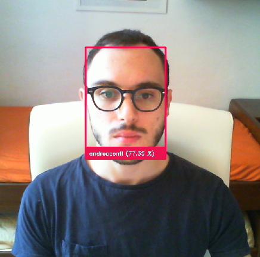
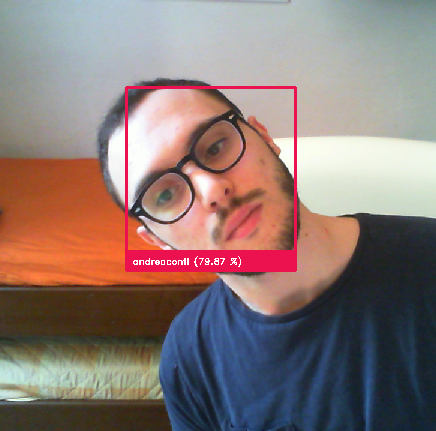
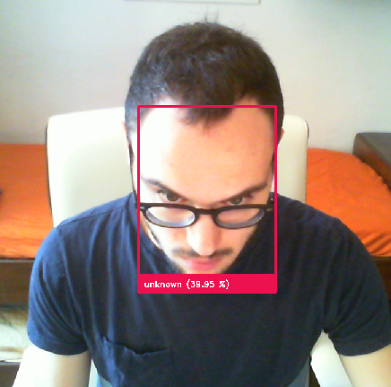
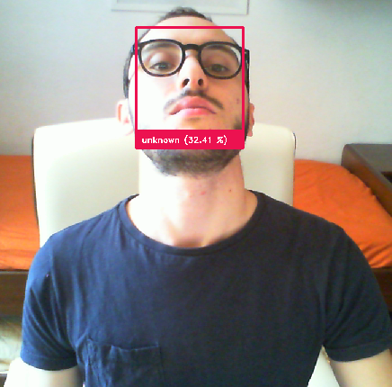
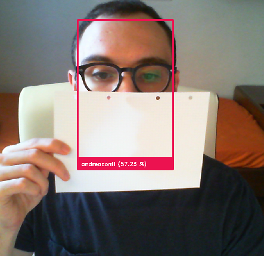
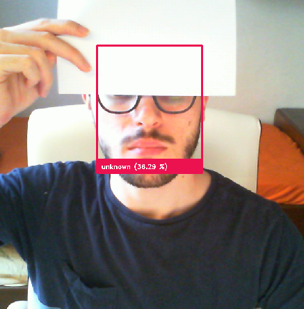

# Face Recognition Cam

This project aims to implement a simple API for a camera with face recognition features mainly for didactic purposes but
I hope it'll be useful to someone.

To accomplish this task some steps are required:

1. find faces
2. find facial landmarks
3. warp faces to standard landmark positions
4. encode faces into vectors
5. search of similarities into a database of known faces

`face_recognition_cam` takes takes care of all of them.

## API Usage

`face_recognition_cam` can be used as a python library, at the core of the library there are two main classes:

- `FaceDetector`, used to detect a faces in the image, crop them, identify facial landmarks and align faces
- `FaceRecognizer`, used to assign a label to each known face or classify them as unknown

Finally some utilities are contained into `util` module:

- `Camera` provides a way to retrieve frames from a camera.
- `CameraAlert` class can be used to monitor a camera and execute custom functions when a face is recognized.

### FaceDetector

```python
import face_recognition_cam as fc

# here we detect all faces contained in the image, this function takes care to:
# - find each face
# - find 5 facial landmarks and use them to align the face
# - resize each face
# - stack them into a numpy ndarray of shape N x H x W x C
face_detector = fc.FaceDetector()
faces = face_detector.crop_aligned_faces(img, resize=(250, 250))
```

<p align="center">
    
    
</p>

### FaceRecognizer

This class takes care to label each face with a name, to do that a dataset of known faces is needed, such dataset can be
generated using `generate_dataset`. `assign_names` method is then used to label faces.

```python
import face_recognition_cam as fc

recognizer = fc.FaceRecognizer()

# dataset generation, people is a dictionary containing as key names and as value a
# set of N faces of that person stacked into an ndarry of shape N x 112 x 112 x 3.
# In `util` module see `load_faces` function to generate people dictionary.

people = {
    "andrea": np.random.randn(3, 112, 112, 3).astype(np.uint8)
}
dataset = recognizer.generate_dataset(people)

# then is possible to identify faces, `min_confidence` is used to choose a threshold
# for unknown labeling

min_confidence = 0.7
names = recognizer.assign_names(dataset, faces, min_confidence)
```

### CameraAlert

This class is useful when you simply want to execute some code when a face is recognized.

```python
import face_recognition_cam as fc

alert = fc.util.CameraAlert()

@alert.register("andrea"):
def say_hello():
    print("Welcome Andrea!")

alert.watch(dataset)
```

## CLI Usage

A simple CLI interface is also available through the `facecam` tool.

```bash
$ facecam
usage: face detection camera [-h] {embed,trigger,show,recognize} ...

positional arguments:
  {embed,trigger,show,recognize}
                        sub-command help
    embed               embed a folder of faces in known faces
    trigger             trigger from the camera and call scripts when
                        recognize someone
    show                watch from cam and show a window with labeled faces,
                        for fun and debug
    recognize           writes the name of all recognized people in the
                        provided image

optional arguments:
  -h, --help            show this help message and exit
```

`facecam embed` can be used to generate the dataset and `facecam show` can be used
to grasp visually the quality of recognition but the most interesting command is
`facecam recognize` which can be used to execute bash command on recognition events.

```bash
$ facecam recognize dataset \
        --on "andrea" 'echo "Hello Andrea"'
        --on "unknown" 'echo "go away please"'
```

## Implementation Details

Each step in the face recognition process is quite complex and is plenty of different
solutions for these tasks, here a brief of used technologies and some reference:

### Face Detection

For face detection there are many robust solutions such as Viola Jones [1], HoG + SVM [2]
and many different kind of Convolutional Neural Networks. Here is used a pretrained model
based on the architecture called  _Single Shot Multi Box Detector_ (SSD) [3] which can
be found [here](https://github.com/opencv/open_model_zoo/tree/master/models/public/face-detection-retail-0044)
under [Apache License Version 2.0](https://github.com/opencv/open_model_zoo/blob/master/LICENSE).

### Facial Landmarks Detection

Facial landmarks are used to localize salient regions of the face such as eyes, nose, mouth and so
on and can be used for many purposes, such as to perform face alignment.
An example of 68 facial landmarks can be found into the
[iBUG 300-W dataset](https://ibug.doc.ic.ac.uk/resources/facial-point-annotations/)

Many different implementations of landmark detection exist, in this project is used the implementation
contained into [dlib](http://dlib.net) using only a subset of 5 landmarks to perform face.

### Face Embedding

Face embedding consists into the transformation of a face into a vector, such process is usually carried
out by a proper trained neural networks and as usual many different ways to accomplish that are avaiable.
A light and effective implementation of MobileFaceNet [4] is used here: a pretrained model can be found
in the [OpenVINO Toolkit](https://github.com/opencv/open_model_zoo). To compare embedded faces
is used _cosine distance_.

## Performances

Here a visual brief about per `face_recognition_cam` recognition performances, face detection is really effective and is robust versus different point of view, scale and rotations.

<p align="center">
  
  
  
  
  
</p>

Face recognition is robust versus rotation and scale but it does not really handle well different points of view, below misclassified examples:

<p align="center">
  
  
</p>

Maybe in further releases robustness will be improved.

Finally occlusion is partially well handled, again face detection is quite effective and face recognition instead becames instable.


<p align="center">
  
  
</p>


---

[1] P. Viola and M. J. Jones, "Robust real-time face detection", 2004

[2] N. Dalal and B. Triggs, "Histograms of oriented gradients for human detection", 2005

[3] W. Liu et al., "SSD: single shot multibox detector", 2015

[4] S. Chen, Y. Liu et al., "Mobilefacenets: Efficient cnns for accurate real-time face verification on mobile devices"
